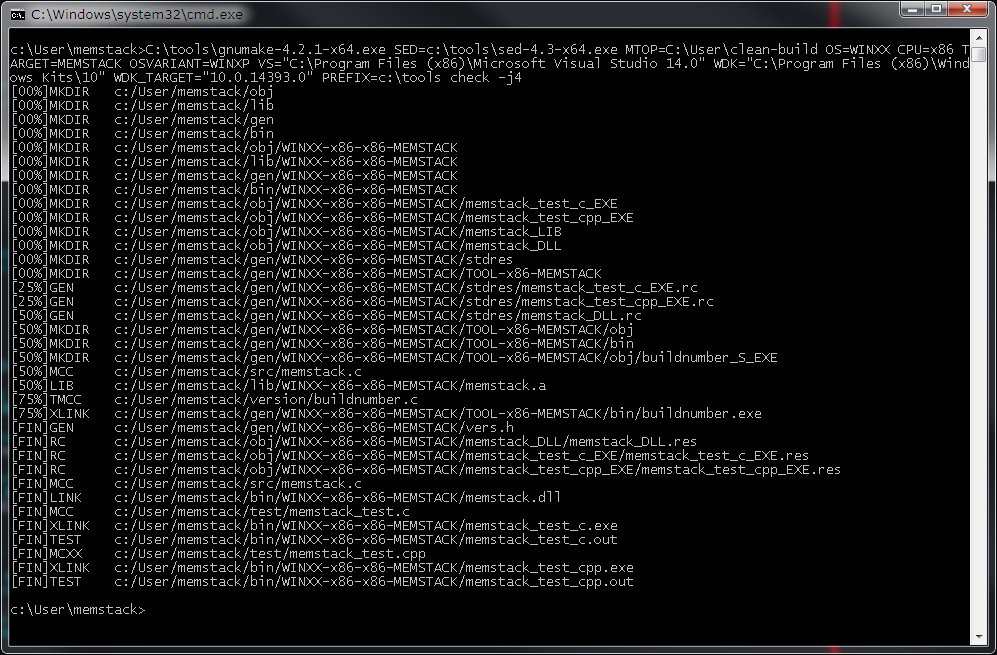

# clean-build
Non-recursive [unharmful](http://aegis.sourceforge.net/auug97.pdf) cross-platform build system based on GNU Make

Copyright (C) 2015-2017 Michael M. Builov (mbuilov@gmail.com)

Current version: 0.1

License: GPLv2 or later

Minimum supported GNU Make version: 3.81

Out-of-the-box supported operating systems: WINDOWS, LINUX, SOLARIS

Main features:

- non-recursive build
- massive parallelism, almost unlimited scaling by CPU number
- modular, extensible design
- platform-independent target makefiles
- multi-platform, using native tools only (no UNIX emulation layer is needed to build on WINDOWS)
- support for cross-makefiles dependencies
- support for cross-compilation
- builtin support for building targets written on languages: C, C++, Java, Scala, Wix
- support for C/C++ precompiled headers
- support for build-time generation of source-header file dependencies (for C/C++)
- support for compiling many-sources-at-once on WINDOWS
- functions for debugging, checking and tracing of target makefiles
- predefined patterns for building shared and static libraries, executables, kernel modules and java archives
- support for custom rules generating multiple target files at one call
- simple batch-file generation for building from scratch without using gnu make: make V=1 > build.bat
- pretty-printed build log on all supported platforms

Full documentation see on [Wiki](https://github.com/mbuilov/clean-build/wiki) page.

An example build log on Windows:

